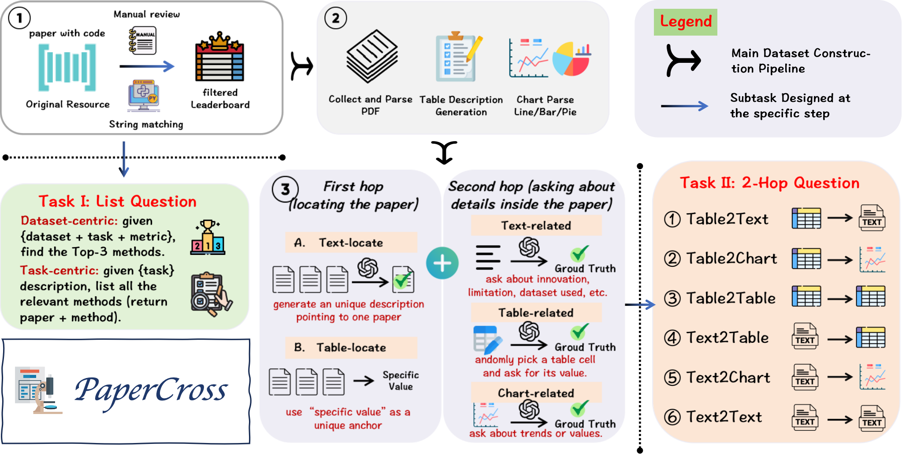

# 📚 PaperCross

PaperCross is an open benchmark dataset for scientific document processing, dedicated to evaluating Retrieval-Augmented Generation (RAG) systems across a variety of question-answering tasks.



---

## 📊 Dataset Statistics

| Category              | Count | Task Type         | Count |
|-----------------------|-------|-------------------|-------|
| Task questions        | 53    | Table-to-Chart    | 404   |
| Dataset questions     | 184   | Table-to-Table    | 788   |
| Leaderboard (5 papers) | 53    | Table-to-Text     | 692   |
| Leaderboard (6 papers) | 68    | Text-to-Chart     | 362   |
| Leaderboard (7 papers) | 63    | Text-to-Table     | 732   |
| Unique papers         | 1002  | Text-to-Text      | 666   |
| Total pages           | 14,064| Total 2-Hop QA    | 3,644 |

---

## 📂 Dataset Files

- **`task.json`** – Task-centric questions  
- **`rank.json`** – Dataset-centric questions  
- **`2hop.json`** – 2-hop reasoning questions  

Example inference logs for ReAct-style reasoning:

- `task_example.json`  
- `rank_example.json`  
- `2hop_example.json`  

---

## 💡 Example Questions

### 1. Dataset-Centric Question
```text
Please help me find the performance of methods proposed in different papers 
on the Accuracy (%) metric for the Unsupervised Image Classification task 
on the ImageNet dataset. List the top three results.

Requirements:
1. For each paper, only list its own proposed method’s best result 
   (ignore baseline or ablation variants).
2. Ensure at least three papers are included.
3. The provided paper_id must refer to the original paper of the method.
4. If multiple papers report different values of the same method under same experiment conditions, take the result from
   the paper which has originally proposed this method

Output format (JSON):
[
  {"rank_id":1, "method":"model name", "value":"metric value", "paper_id":"paper id"},
  {"rank_id":2, "method":"model name", "value":"metric value", "paper_id":"paper id"},
  {"rank_id":3, "method":"model name", "value":"metric value", "paper_id":"paper id"}
]
```

---

### 2. Task-Centric Question
```text
Find all papers that either explicitly proposed methods 
for the Human Keypoint Detection task, 
or introduced methods that can be effectively applied to it. 

Requirements:
- Provide paper ID and method name.
- If the original paper of a method cannot be identified, exclude it.

Output format (JSON):
[
  {"paper_id":"paper id", "method": "method name"},
  {"paper_id":"paper id", "method": "method name"},
  ...
]
```

---

### 3. 2-Hop Question
```text
In the paper where a proposed method achieves 0.898 SSIM 
on the Video Prediction task (dataset: Moving MNIST), 
what SSIM value is reported by the final 
Causal LSTM + GHU model on the MNIST-2 dataset with 10 time steps?

Output format (JSON):
{"paper_id":"paper id", "answer": "answer"}

```


---

## 📑 About
PaperCross is designed for **evaluating RAG systems in scientific QA tasks**.  
It covers diverse scenarios including task-centric reasoning, dataset-level ranking, and multi-hop question answering, enabling a comprehensive benchmark for retrieval + generation systems.  
